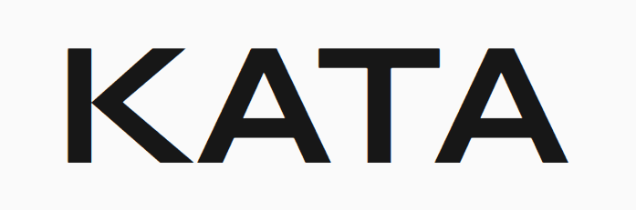
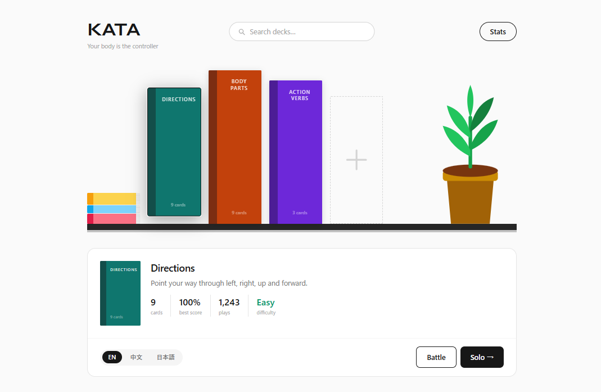
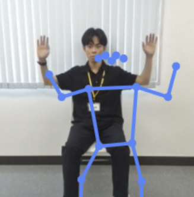
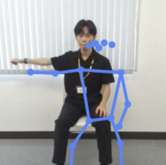
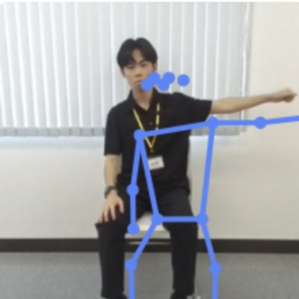
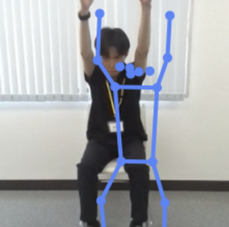
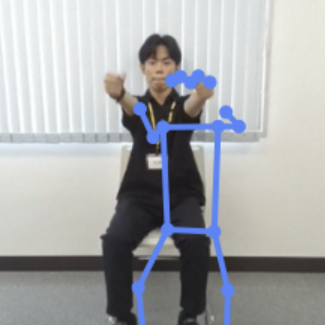

<div align="center">



### Your body is the controller.

Act out the meaning of a word — point, reach, touch, strike a pose — and the camera detects your motion to flip the card. A gamified way to learn vocabulary by *moving*.

<br />

[](https://overclocked-neon.vercel.app)

<br />


</div>

<br />

<div align="center">
  
</div>

<br />

## What is KATA?

**KATA** turns vocabulary practice into a full-body game. Instead of tapping a screen, you *become* the word: extend your arm for **Left**, raise both hands for **Up**, cross your arms for **Wrong**. A pose-detection model watches through your webcam and clears the card the moment it recognizes the right motion.

It was built at a hackathon under the theme of **expanding the user's own thinking, action, and creativity** — learning that lives in your body, not just your fingertips.

> **Team Overclocked** — Miki Kamochi · Horise Yoshito

<br />

## 🕺 Pose detection in action

Every frame from your webcam is run through a [Teachable Machine](https://teachablemachine.withgoogle.com) **Pose** model — entirely **on-device**, so no video ever leaves your browser. The blue skeleton is the live pose estimate driving the game.

<div align="center">

| Idle | Left | Right | Up | Forward |
|:---:|:---:|:---:|:---:|:---:|
|  |  |  |  |  |
| *neutral* | *extend left arm* | *extend right arm* | *raise both arms* | *push arms forward* |

</div>

<br />

## ✨ Features

- 🤸 **Pose-controlled flashcards** — hold the right motion and the card flips itself; no buttons.
- 🔒 **Runs on-device** — pose detection happens in the browser via TensorFlow.js; your camera feed never goes to a server.
- ⚔️ **Battle mode** — race a friend head-to-head in real time over a shared room code.
- 🌍 **Trilingual** — every word, hint, **and** spoken voice in English / 中文 / 日本語.
- 🔊 **Juicy feedback** — 3-2-1 countdown, correct/wrong sounds, flip & shake animations.
- 🦴 **Skeleton toggle** — show or hide the detected pose overlay so you can see what the model sees.
- 📊 **Stats dashboard** — best scores, totals, and a 7-day activity chart, saved locally.
- 🧪 **Mock mode** — no trained model? A "Simulate motion" button stands in, so the whole game is playable without a camera model.

<br />

## ⚔️ Battle mode

Two players on separate devices can race head-to-head:

1. One player **creates a room** and shares the 4-character code.
2. The other **joins** with that code and both snap a quick selfie.
3. The host starts — both players get the **same deck in the same order** (seeded shuffle), and their 3-2-1 countdowns fire at the **same wall-clock moment**.
4. A **live progress bar** shows your opponent's position. First to clear all cards wins. 👑

Only tiny score updates cross the wire — pose detection stays local on each device.

<br />

## 🧠 How the magic works

```
Webcam frame → Teachable Machine Pose → { class, probability }[] per frame
            → MotionMatcher.push()    → confirmed match → card clears
```

The matcher isn't a naive "is the pose right?" check. A frame only **qualifies** when the target motion clears a confidence threshold **and** beats the neutral `idle` class by a margin. It takes several *consecutive* qualifying frames to confirm — and a single flickered frame only nudges the counter down, so camera noise can't trigger a false match. After a match it **disarms** until you return to neutral, so holding a pose can't accidentally clear the next card.

See [`src/game/matcher.ts`](src/game/matcher.ts) and [`src/components/GameScreen.tsx`](src/components/GameScreen.tsx).

<br />

## 🛠️ Tech stack

| Layer | Choice |
|-------|--------|
| Frontend | Vite + React + TypeScript |
| Styling | Tailwind CSS |
| Pose detection | Teachable Machine Pose (TensorFlow.js + PoseNet), loaded via CDN |
| Multiplayer | Supabase Realtime — Broadcast + Presence (no database tables) |
| Deploy | Vercel (HTTPS required for camera access) |

<br />

## 🚀 Run locally

```bash
npm install
npm run dev        # dev server at localhost:5173 (+ a network URL for phones)
npm run build      # type-check + production build → dist/
npm run preview    # preview the production build
```

### Battle mode requires Supabase

Create a `.env.local` file in the project root:

```
VITE_SUPABASE_URL=https://<your-project>.supabase.co
VITE_SUPABASE_ANON_KEY=<your-anon-key>
```

The **Battle** button only appears when both variables are present — solo mode works without them. Deployed builds read the same variables from the Vercel project settings.

<br />

## 📚 Decks

| Deck | Words | Motions |
|------|-------|---------|
| **Directions** | Left, West, Right, East, Up, Above, North, Forward, Ahead | extend arms left/right, raise arms, push forward |
| **Body Parts** | Head, Forehead, Shoulders, Knees, Kneecap, Toes, Foot | touch each body part |
| **Body Language** | Correct, OK, Wrong, False, Thinking, Braining, T-Pose, Bow | O-shape, X-shape, hand-to-chin, arms wide, bow |

Each game serves a fixed **10 cards** — shorter decks shuffle and repeat to fill the round, so your max score is always out of 10.

<br />

## ➕ Adding a new deck

1. Train a **Teachable Machine Pose** project at [teachablemachine.withgoogle.com](https://teachablemachine.withgoogle.com).
   - One class per motion, **plus an `idle` class** (standing neutral) to prevent false triggers.
   - Keep it to **4–8 physically distinct** poses for reliable accuracy.
   - Favor held arm/torso poses with clear silhouettes — the webcam barely catches fast or leg-based gestures.
   - Record ~5–10 varied bursts per class (different angles, speeds, people).
2. Export → **TensorFlow.js** → drop the 3 files (`model.json`, `metadata.json`, `weights.bin`) into `public/models/<deckId>/`.
3. Add the deck entry to [`src/data/decks.ts`](src/data/decks.ts) — the `motion` strings must match the Teachable Machine class names (case-insensitive).

<br />

<div align="center">

Made with 🤸 by **Team Overclocked** — Miki Kamochi · Horise Yoshito

</div>
